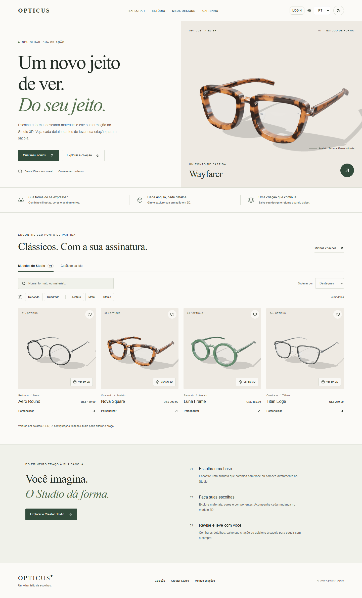
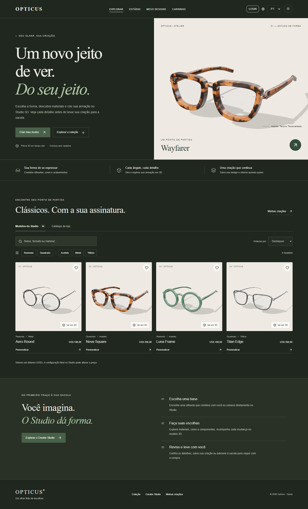
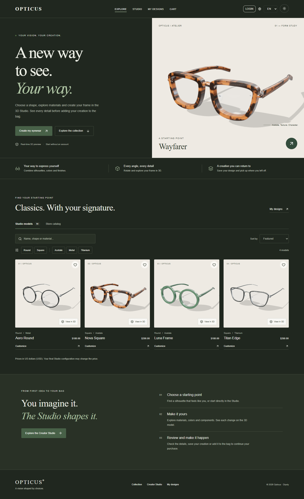
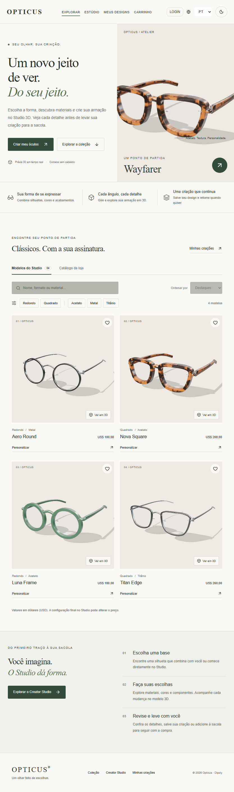
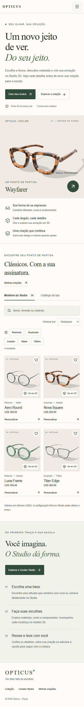
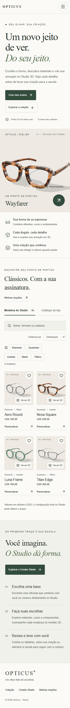
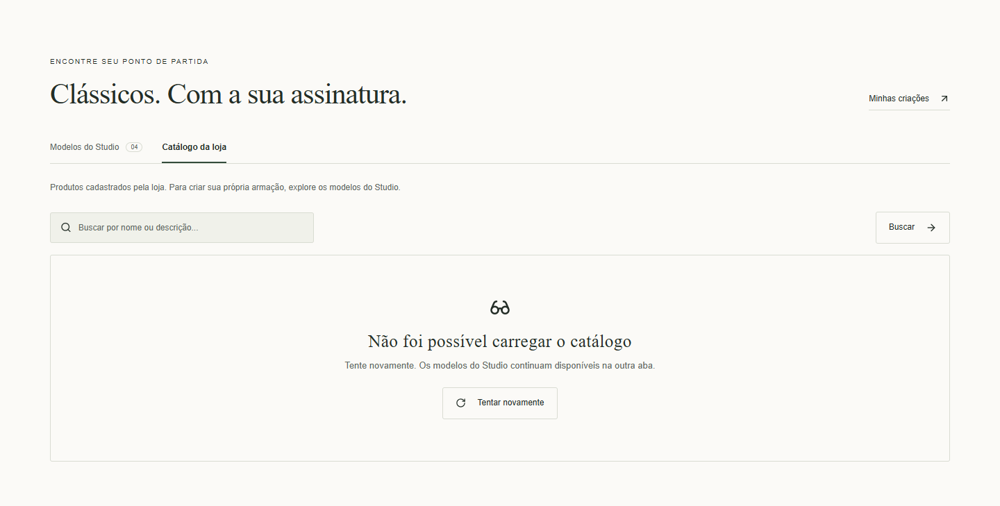
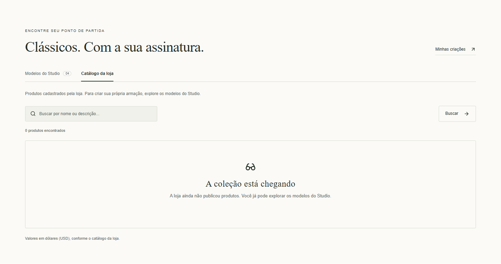

# FE-07 — Página principal e Marketplace

Implementação da [issue #66](https://github.com/EZLBR/n392-Dipoly-opticus/issues/66).
A branch `feat/fe-07-marketplace-redesign` parte da STUDIO-01 (`25ff7a6`), enviada no PR #74.
Revisar a FE-07 sobre essa branch até a integração do Studio na `dev`; depois atualizar a base do PR.

## Experiência

- Hero com proposta de personalização, entrada no Studio e ação que leva ao catálogo com foco no título.
- Benefícios, quatro modelos em destaque, processo em três etapas e navegação para criações salvas.
- Paleta clara/verde e modo escuro compatíveis com o Studio, textos PT/EN e navegação móvel.
- Busca por nome/formato/material, incluindo termos em português sem acentos; filtros combináveis, ordenação por preço/nome e favoritos persistidos.
- As quatro bases legadas mantêm IDs e preços de referência (USD 180/200/180/260), calculados pela função de preço existente.
- A seleção transfere a configuração explícita ao Studio. O contrato antigo baseado em ID continua aceito; rascunhos do mesmo modelo continuam restaurados.

## Catálogo remoto

Os quatro modelos procedurais permanecem na aba **Modelos do Studio**. A aba **Catálogo da loja** consulta o endpoint público existente `GET /api/products?page=1&limit=12&search=...`, conforme `VITE_API_URL`.

O contrato atual retorna `produtos`, `total` e `totalPages`, com nome/descrição/preço/imagem/categoria/estoque. Não fornece configuração 3D ou fábrica do produto. Por isso, a aba apresenta produtos e seus detalhes sem inventar uma configuração procedural, fábrica ou nova regra de checkout.

Carregamento, catálogo vazio, busca sem resultados, erro com repetição, paginação e imagem indisponível têm estados próprios. Requisições antigas são canceladas e não substituem respostas atuais. Uma consulta é interrompida após 12 segundos. A página inicial e o catálogo do Studio funcionam mesmo com o backend indisponível.

## Imagens e carregamento

As cinco imagens em `frontend/public/eyewear/` foram capturadas do próprio `EyewearViewer` em Chromium, com os controles ocultos durante a captura. Não representam um produto diferente do construtor do Studio. As configurações correspondentes estão em `components/marketplace/catalog.ts`; o hero usa Nova Square (Wayfarer/acetato tartaruga/perfil grosso).

A página inicial usa imagens estáticas, sem canvas ou renderizadores WebGL. O hero tem prioridade de carregamento; as imagens dos cards têm dimensões reservadas e carregamento adiado. A visualização interativa continua no Studio.

## Validação — 29/09/2026

- `npm run typecheck`, `npm test` (35 testes) e `npm run build`.
- Testes de navegação, foco, combinações de filtros, ordenação, favoritos, PT/EN, configuração e preço transferidos ao Studio, carregamento sob demanda, API vazia, erro/repetição, busca/paginação, cancelamento e contrato inválido.
- Chromium: desktop 1440 px, tablet 834 px, celulares 390 e 320 px sem overflow horizontal; modo escuro e inglês; menu móvel, filtros, detalhes em dialog com Escape e abertura de Nova Square no Studio.
- Sem erros de execução no navegador durante a verificação; zero canvases na página inicial.
- A integração visual do catálogo foi verificada com respostas HTTP controladas para sucesso, vazio e erro, conforme o contrato real. Não foi necessário iniciar PostgreSQL nem realizar pagamentos.
- Permanece o aviso anterior de bundles maiores que 500 kB (aplicação principal/visualizador 3D).

## Evidências

