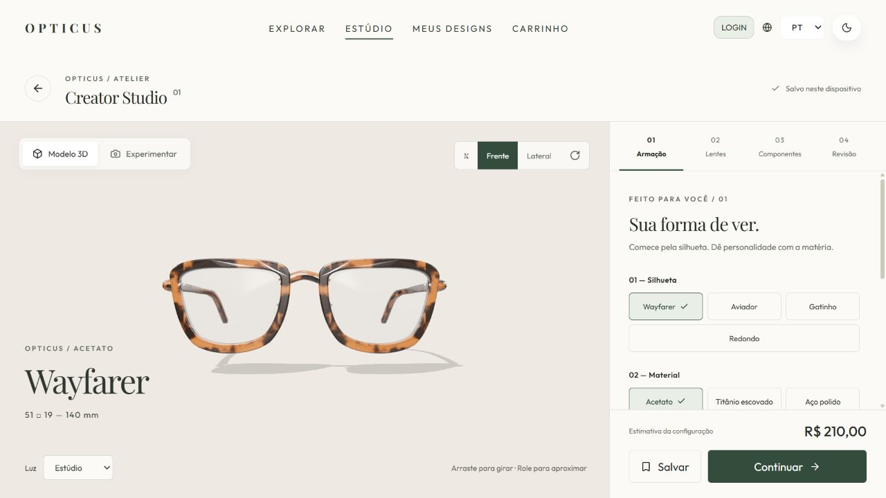
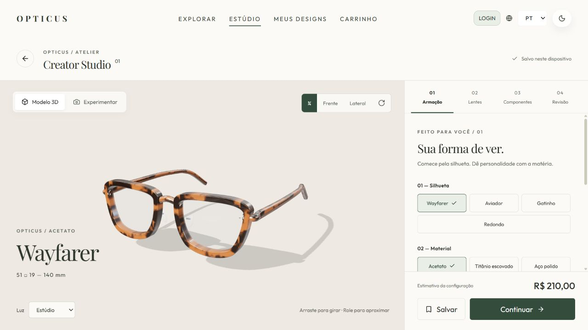
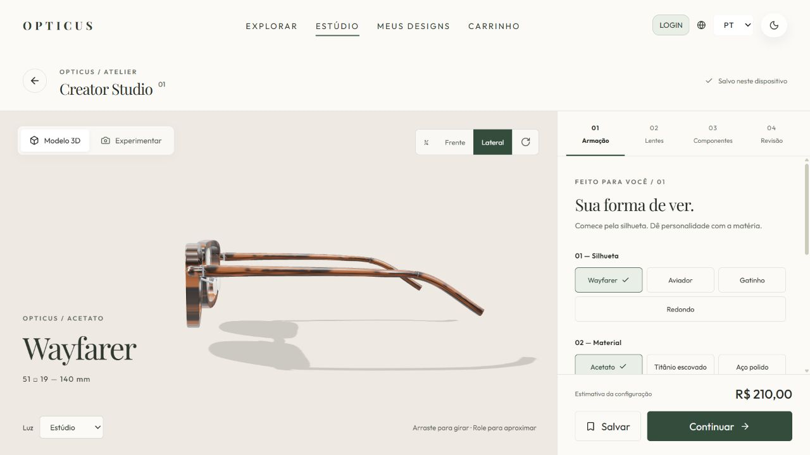
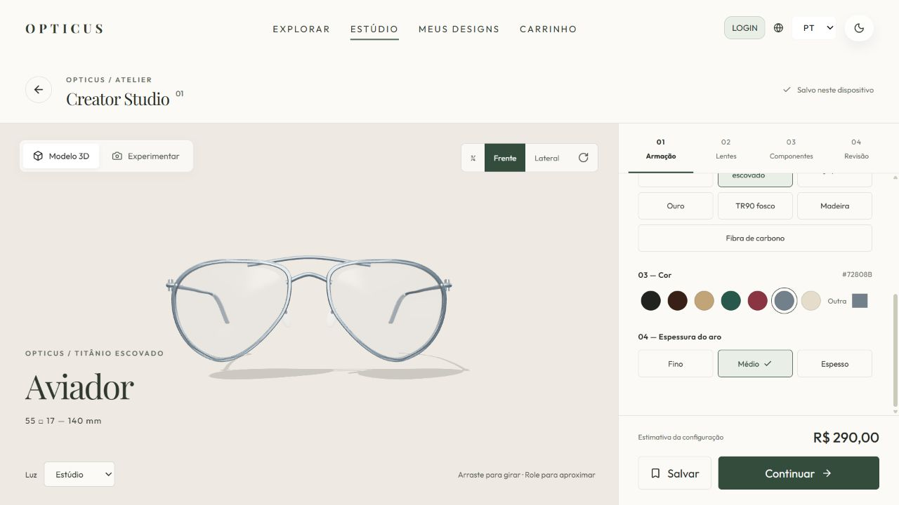
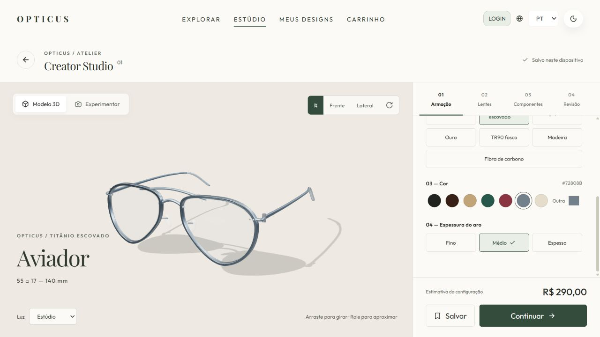
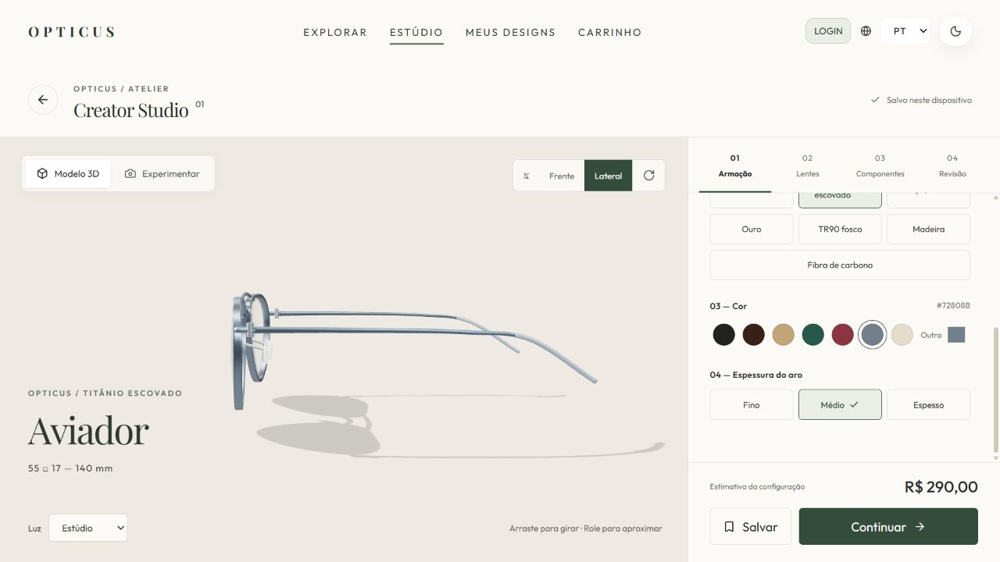
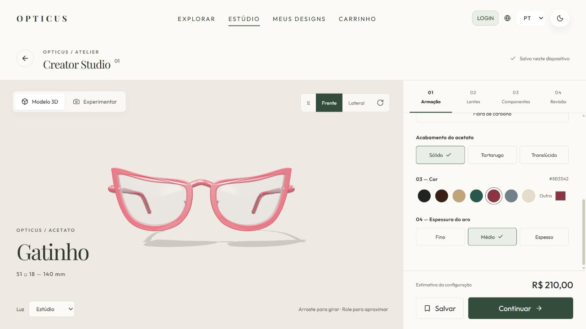
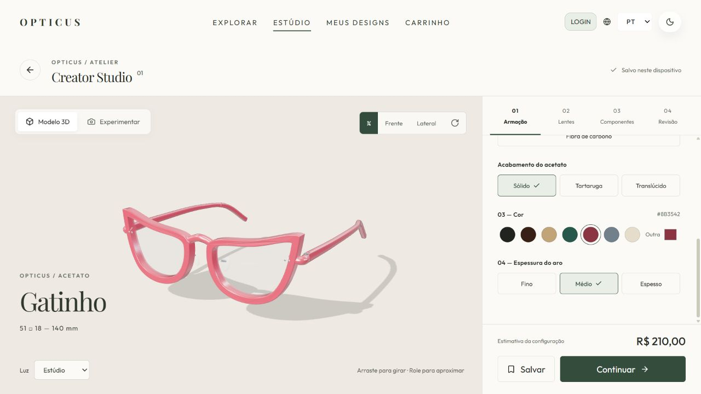
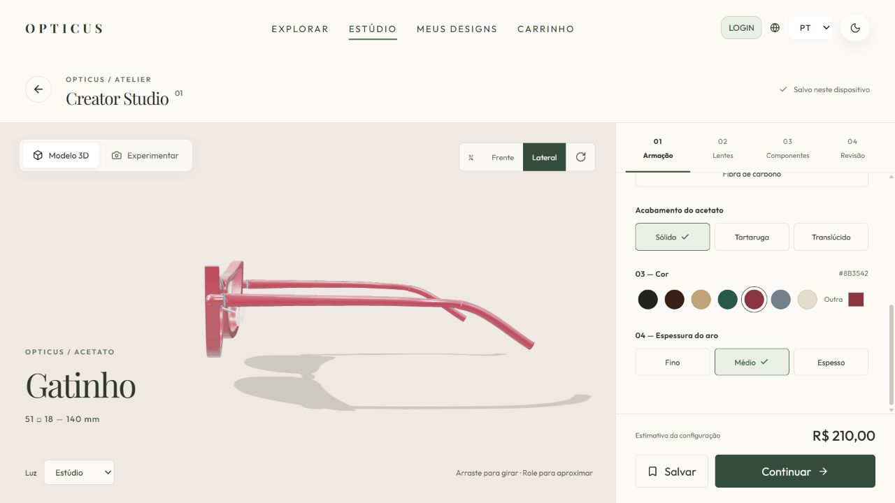
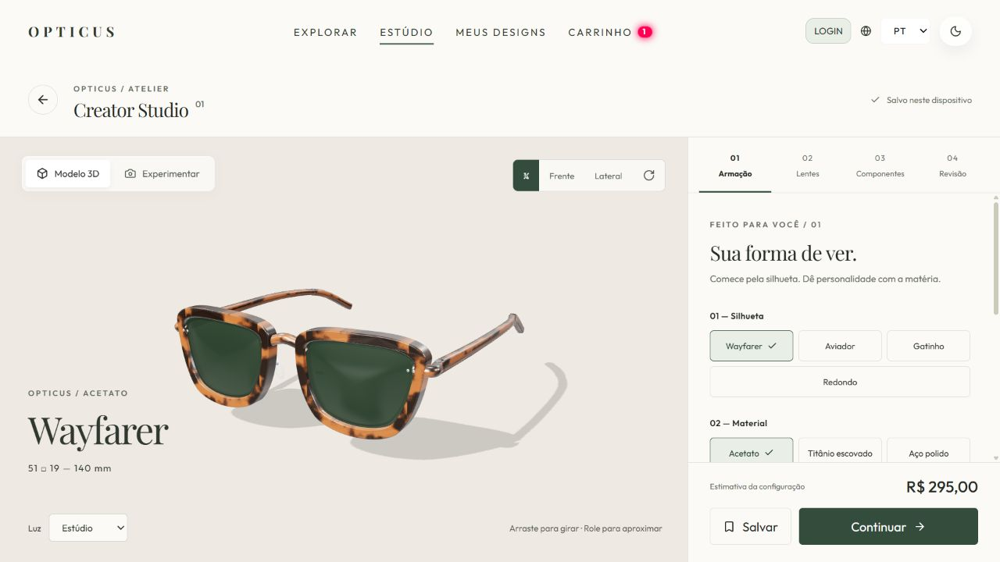

# STUDIO-01 — modelo procedural e Creator Studio

Implementação de frontend da [issue #53](https://github.com/EZLBR/n392-Dipoly-opticus/issues/53).
Branch: `feat/studio-01-realistic-eyewear`, criada a partir de `origin/dev` em `40e4d88`.
Não altera backend, autenticação, banco de dados nem as regras de cálculo de preço.

## Construção

- `frontend/src/eyewear/config.ts`: contrato canônico, valores permitidos e normalização dos formatos antigos.
- `geometry.ts`: curvas Bézier espelhadas, aros extrudados com bordas arredondadas, curvatura frontal, lentes com duas superfícies, ponte, plaquetas, dobradiças, rebites, hastes afuniladas e ponteiras. Unidades em milímetros.
- `materials.ts`: materiais físicos, texturas procedurais determinísticas de tartaruga/madeira/carbono e aparência compartilhada com o provador.
- `EyewearViewer.tsx`: câmera, iluminação de ambiente, controles de órbita, vistas frontal/¾/lateral, zoom por teclado, sombras e recuperação de contexto WebGL.
- Studio, catálogo, galeria e carrinho usam esse mesmo construtor. Mudar cor/lentes/acabamento não reconstrói a geometria. Dobrar hastes transforma os pivôs existentes.
- Geometrias substituídas, materiais, texturas, ambiente, renderer, observadores e controles são descartados. Miniaturas estáticas não são redesenhadas continuamente.

As proporções são referências conceituais, não medidas de fabricação ou receita óptica:

| Silhueta | Lente (largura × altura) | Ponte | Haste |
| --- | --- | --- | --- |
| Wayfarer | 51 × 38 mm | 19 mm | 140 mm |
| Aviador | 55 × 46 mm | 17 mm | 140 mm |
| Gatinho | 51 × 37 mm | 18 mm | 140 mm |
| Redondo (legado) | 47 × 44 mm | 21 mm | 140 mm |

Referências visuais de famílias de armação, sem copiar malhas, marcas ou dimensões exatas:
[Original Wayfarer](https://www.ray-ban.com/usa/sunglasses/RB2140F%2BUNISEX%2Boriginal%2Bwayfarer%2Bclassic-black/8056597147347),
[Aviator Classic](https://www.ray-ban.com/usa/sunglasses/RB3025%20UNISEX%20aviator%20classic-black/805289115687) e
[Oliver Peoples 1953RX](https://www.oliverpeoples.com/en-row/products/0ov5585u-1492).
A implementação é própria e paramétrica. Materiais baseados em [MeshPhysicalMaterial](https://threejs.org/docs/pages/MeshPhysicalMaterial.html).

## Opções e fluxo

Quatro etapas: armação, lentes, componentes e revisão. Interface PT/EN, controles com nomes acessíveis,
estados selecionados, foco visível, movimento reduzido e modal nativo com confinamento de foco.

Acetato sólido, tartaruga ou translúcido; TR90 fosco; titânio; aço; ouro; madeira e carbono.
Os materiais com aparência natural mantêm sua própria paleta. Lentes solares, espelhadas, antirreflexo
e filtro azul alteram a aparência. Fotocromático escurece no cenário Sol. UV e polarização não recebem
uma cor artificial: são propriedades ópticas, não uma simulação física desses fenômenos.

O botão de revisão adiciona a configuração inteira ao carrinho; o checkout existente continua a partir
dali, com as mesmas regras de preço e autenticação. O identificador de fábrica de demonstração segue o
fluxo legado da galeria; a escolha real da fábrica não faz parte desta entrega.

## Compatibilidade e persistência

Restauração antes do primeiro autosave; rascunhos vinculados à origem (novo/produto/design), incluindo
acabamento e ângulo das hastes. Aceita `square`, `round`, nomes compostos de modelos e campos snake_case.
A seleção usa ID estável, mantendo compatibilidade com o índice antigo.

O retorno real de POST /api/designs é `{ success, id }`; o salvamento agora o reconhece e atualiza
imediatamente a galeria. Um design existente é atualizado no cache, sem duplicação.

**Limitação do contrato atual:** o backend não possui campos para todos os materiais/componentes.
A configuração completa fica no localStorage deste navegador; os campos legados continuam sendo
enviados normalmente. A atualização da lista mescla os campos remotos com a configuração local,
e preserva designs locais ainda não sincronizados. Sem backend, o salvamento é explicitamente local.
Abrir em outro dispositivo não recupera todos os materiais; limpar os dados do site apaga essa parte.
Não foram adicionadas migrations nem uma codificação escondida de JSON no nome do modelo.

## Provador

Compartilha contornos, proporções, perfil e paleta do modelo canônico, com atualização por referência
durante o rastreamento. Continua sendo uma aproximação frontal 2D, não um ajuste tridimensional ao rosto.
A interface informa que não mede encaixe. A câmera só é solicitada ao selecionar Experimentar.
Fluxos assíncronos cancelados param streams recém-obtidos; o rastreador é fechado ao sair.
Aguardando permissão, falha, repetição e volta ao 3D têm estados explícitos.

## Validação

Executado localmente em 24/09/2026 (Node 24; CI do projeto utiliza Node 22):

- `npm run typecheck`: passou.
- `npm test`: 21 testes passaram (16 de configuração/geometria/materiais/persistência + 5 de preço existentes).
- `npm run build`: passou; permanece aviso de bundles acima de 500 kB, incluindo Three.js.
- `git diff --check`: passou.
- Inspeção de Wayfarer, Aviador e Gatinho nas três vistas abaixo; troca de material, lentes, fotocromático e dobra.
- Salvar localmente → galeria → reabrir: preservados modelo, material, cor, lente de policarbonato, tratamentos e hastes.
- Revisão → carrinho: configuração e preço corretos; miniatura usa o mesmo modelo.
- Layout 390 × 844: largura de documento 390 px, uma única canvas; prévia fixa visível e rodapé de ações dentro do viewport.
- PT/EN e retorno do estado de espera de permissão da câmera para o 3D verificados. Sem erros no console durante a sessão.

**Validação pendente:** câmera real/rastreamento facial, rejeição explícita de permissão em dispositivos,
pagamento autenticado e sincronização real com PostgreSQL não foram exercitados. Nenhum pagamento,
acesso à câmera, merge ou fechamento da issue foi realizado. Não há certificação completa WCAG nesta entrega.

## Evidências visuais

| Modelo | Frontal | ¾ | Lateral |
| --- | --- | --- | --- |
| Wayfarer / acetato tartaruga |  |  |  |
| Aviador / titânio |  |  |  |
| Gatinho / acetato |  |  |  |

